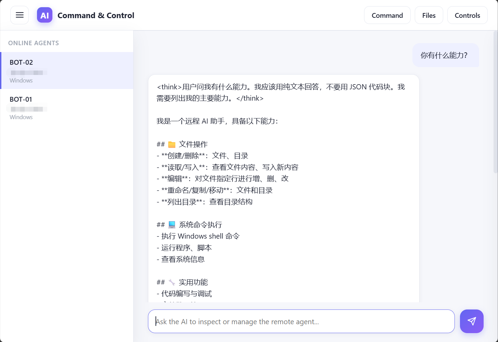
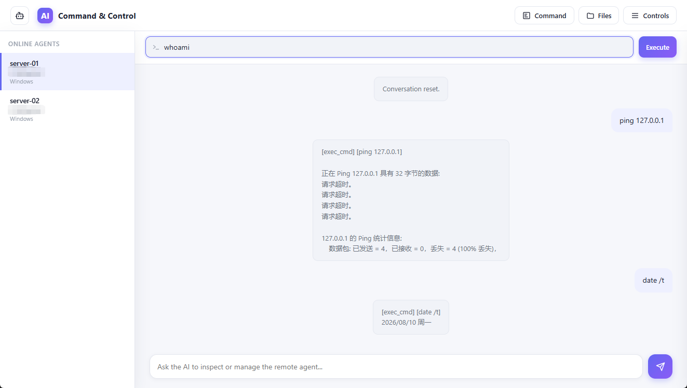
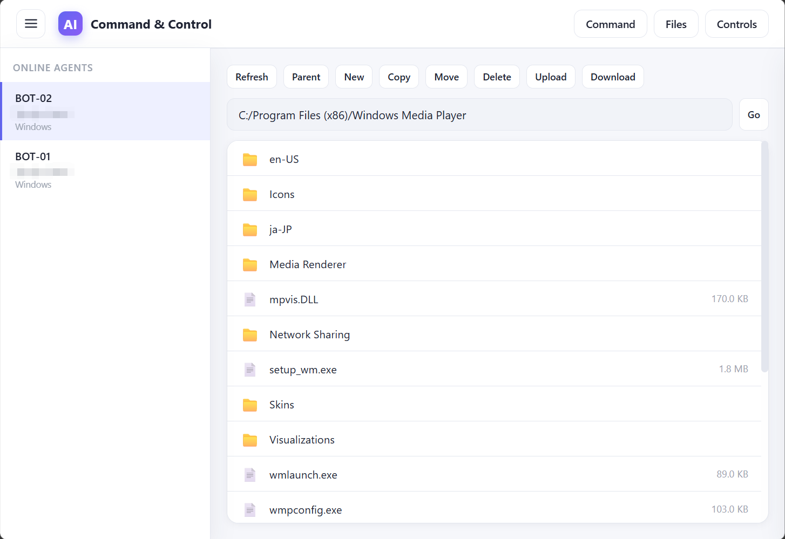
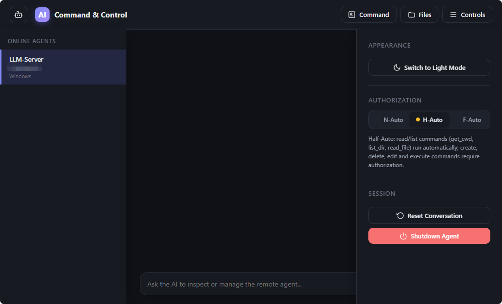

# Irudo

A C2 framework based on  AI LLM

***

# Introduction

A C2 remote control framework based on AI large language model.

Users communicate with the large language model via C2 and forward commands issued by the model to the Bots for execution.

All Bots connect to a common C2 and are controlled by the same user/LLM, much like the Irudo aliens in the Ultraman series.

***

# AI Command & Control Tool

基于 LLM 的远程控制工具，通过自定义二进制 TCP 协议通信。

完整设计文档：[`设计文档.md`](./设计文档.md)

## 功能特性

- **C2 / Agent 双端架构**：C2 端负责 LLM 对话与指令路由，远程端无头执行（无本地 CLI/Web）
- **多 Agent 支持**：C2 可同时纳管多个远程端，每个 Agent 独立 LLM 会话，切换后历史保留
- **LLM 驱动命令执行**：AI 输出 JSON 命令 → C2 路由 → 远程端执行 → 结果回灌 LLM 续轮
- **授权控制**：命令执行前可要求授权（CLI `/y`/`/n` 提示，Web 弹窗），或自动授权
- **通信加密**：注册认证通过后，全部流量（含身份确认包）使用 **ChaCha20**（RFC 7539）流式加密，密钥为认证 token 的 SHA-256 派生值，双向独立 nonce；零三方依赖（Python 纯实现 + C 自包含实现）
- **文件操作**：文件读写/编辑/复制/移动/上传下载（1024 字节分包 + 结束标记，流式读写）
- **会话韧性**：Web 对话作为后台任务运行，**页面刷新/断连不会中断对话**，刷新后自动重连会话流；Agent 掉线时自动切换激活 Agent，并同步聊天历史与文件管理器视图
- **指令串行锁**：每个 Agent 持有独立指令锁，命令与文件传输在同一 Agent 内严格串行、互不交错；不同 Agent 的会话可并发独立执行
- **Web 文件传输**：上传字节先流式缓冲到 `ul_temp_dir`（uuid 唯一名，传输结束即删除），再传输至 Agent；下载先落盘 `dl_temp_dir` 再回传操作者浏览器（临时文件保留，重名覆盖）
- **远程关机**：下发 `shutdown` 指令关闭远程端进程（非系统关机）
- **心跳保活**：远程端周期性心跳，C2 watchdog 超时自动剔除失联 Agent（`active_ops` 保护执行中的 Agent 不被误踢）
- **CLI 与 Web 双界面**：Web 支持 Agent 切换、文件管理、授权弹窗、深浅主题、直连命令
- **多语言远程端**：除 Python 远程端（`remote/`）外，提供零三方依赖的 **C 版远程端**（`remote-c/`），win/linux 下 gcc 直接编译、参数与 Python 版一致
- **一键打包**：`build/` 提供 C2 / 远程端独立的 bat/sh 编译脚本，产出单文件可执行程序

## 架构

```
C2 端（控制端）                            远程端（被控端 / Agent）
┌──────────────────┐                  ┌──────────────────┐
│   CLI / Web      │                  │   Agent daemon   │
│ ┌──────────────┐ │  TCP + 二进制协议 │ ┌──────────────┐ │
│ │ ModelModule  │ │ ◄──────────────► │ │   Handler    │ │
│ │  (LLM 对话)  │ │   request_id     │ │  (指令解析)  │ │
│ └──────┬───────┘ │   TLV 参数       │ └──────┬───────┘ │
│        │         │   单一字符串结果   │        │         │
│ ┌──────┴───────┐ │                  │ ┌──────┴───────┐ │
│ │  Forwarder   │ │                  │ │  LocalExec   │ │
│ └──────┬───────┘ │                  │ │  + FileOps   │ │
│        │         │                  │ └──────────────┘ │
│ ┌──────┴───────┐ │                  └──────────────────┘
│ │ NetworkSrv   │ │
│ └──────────────┘ │
└──────────────────┘
```

## 目录结构

```
XXX/
├── 设计文档.md                # 详细设计
├── README.md                  # 本文件
├── requirements.txt           # 运行时依赖（含 pyinstaller 编译依赖）
├── config_c2.example.json     # C2 配置示例
├── config_remote.example.json # 远程端配置示例
├── build/                     # 编译脚本（PyInstaller 单文件产物）
│   ├── build.bat / build.sh                # C2 端编译
│   └── build_remote.bat / build_remote.sh  # 远程端编译
├── web/
│   └── index.html             # C2 Web UI
├── common/                    # 共享：协议
│   └── protocol.py
├── src/                       # C2 端
│   ├── c2/
│   │   ├── agent_registry.py  # Agent 状态 + per-Agent 历史 + 指令锁
│   │   ├── network_server.py  # TCP 监听 + 鉴权 + 心跳 watchdog + 下载数据路由
│   │   ├── forwarder.py       # 指令转发 + 控制包（每 Agent 指令锁串行）
│   │   └── file_transfer.py   # 上传/下载（流式、临时目录、错误标记）
│   ├── llm.py                 # LLM 调用 + JSON 命令解析
│   ├── command.py             # 动作路由 + 安全检查
│   ├── controller.py
│   ├── config.py              # 配置 + dl/ul 临时目录解析
│   ├── model.py               # per-Agent 会话（后台任务 + SSE 重连）
│   ├── main.py                # C2 入口（CLI/Web）
│   └── web_server.py          # C2 Web（FastAPI + NetworkServer 共存）
├── remote/                    # 远程端（Python，独立包）
│   ├── agent_client.py        # TCP 拨号 + 心跳 + 重连
│   ├── handler.py             # 包解析 + 指令路由 + 文件传输
│   ├── local_executor.py      # 文件/Shell 执行
│   ├── file_transfer.py       # 数据包收发
│   └── main.py                # 远程端入口
└── remote-c/                  # 远程端（C 版，零三方依赖，gcc 编译）
    ├── agent.h / protocol.c / actions.c / exec_cmd.c / main.c
    └── COMPILE.txt            # 编译指令与用法
```

## 环境要求

- Python 3.9+
- （可选）gcc / MinGW-w64：编译 C 版远程端（`remote-c/`）
- 远程端与 C2 端可互相访问 TCP 端口（默认 C2 监听 `8881`，Web 面板 `8880`）

## 安装

```bash
pip install -r requirements.txt   # 运行时依赖（含 pyinstaller）
```

## 编译打包

项目提供两套独立的 PyInstaller 编译脚本（`build/`），产物为**单文件可执行程序**：

| 脚本                                        | 产物                            | 说明                     |
| ------------------------------------------- | ------------------------------- | ------------------------ |
| `build/build.bat` / `build/build.sh`        | `build/irudo_c2(.exe)`          | C2 端（CLI + Web 双模式）|
| `build/build_remote.bat` / `build/build_remote.sh` | `build/irudo_remote(.exe)` | Python 远程端          |

```bash
# Windows
build\build.bat            # C2 端
build\build_remote.bat     # Python 远程端

# Linux / macOS
./build/build.sh           # C2 端
./build/build_remote.sh    # Python 远程端
```

> 编译依赖 PyInstaller（`requirements.txt` 已包含；脚本在缺失时也会自动安装）。
> 配置不嵌入可执行程序：运行产物时需用 `--config` 指定外部配置文件路径。

**C 版远程端**无需编译脚本，直接使用 gcc 编译（详见 `remote-c/COMPILE.txt`）：

```bash
# Linux
gcc -O2 -Wall -Wextra -o irudo_remote remote-c/protocol.c remote-c/actions.c remote-c/exec_cmd.c remote-c/main.c

# Windows (MinGW-w64)
gcc -O2 -Wall -Wextra -o irudo_remote.exe remote-c/protocol.c remote-c/actions.c remote-c/exec_cmd.c remote-c/main.c -lws2_32
```

## 配置

复制示例配置并按需修改：

```bash
cp config_c2.example.json config_c2.json      # 填入 LLM API 地址/密钥/模型
cp config_remote.example.json config_remote.json  # 填入 C2 地址/agent id/token
```

**C2 关键项**（`config_c2.json`）：
- `api_base` / `api_key` / `model`：LLM API（OpenAI 兼容）
- `listen_host` / `listen_port`：Web 面板监听（默认 `127.0.0.1:8880`）
- `c2_host` / `c2_port`：C2 网络监听，供远程端连接（默认 `0.0.0.0:8881`）
- `c2_auth_tokens`：预共享 token（**单个字符串值**，仅允许一个），用于挑战-响应注册握手
- `heartbeat_timeout_sec`：C2 心跳 watchdog 超时（默认 60）
- `system_prompt`：提示词（`{system_name}` 占位符由 C2 按激活 Agent 的 OS 动态替换）
- `dl_temp_dir` / `ul_temp_dir`：下载 / 上传的临时目录。为空时：下载使用 C2 程序工作目录下的 `downloads/`（自动创建），上传使用系统默认临时目录；指定后自动创建

**远程端关键项**（`config_remote.json`）：`c2_address`、`agent_id`、`auth_token`。

## 启动

### C2 端

```bash
# CLI 模式
python -m src.main --mode cli --config config_c2.json

# Web 模式
python -m src.main --mode web --config config_c2.json
```

编译为单文件后（见「编译打包」）：

```bash
./build/irudo_c2 --mode cli --config config_c2.json    # Linux/macOS
build\irudo_c2.exe --mode web --config config_c2.json  # Windows
```

### 远程端

**配置文件方式**：

```bash
python -m remote.main --config config_remote.json
```

**纯命令行方式**（无需任何文件）：

```bash
python -m remote.main \
    --c2-address 192.168.1.100:8881 \
    --agent-id server-01 \
    --auth-token token-for-server-01
```

**混合方式**（配置文件提供默认值，命令行覆盖）：

```bash
python -m remote.main --config base.json --c2-address other:8881
```

**C 版远程端**（`remote-c/` 编译产物，参数与 Python 版一致）：

```bash
./irudo_remote --c2-address 192.168.1.100:8881 --agent-id server-01 --auth-token token-for-server-01
```

### Web 界面

启动 Web 模式后，浏览器打开 `http://<listen_host>:<listen_port>`：

- 顶部左侧：汉堡按钮 + 左侧 Agent 栏（在线 Agent 列表：ID / hostname / OS，点击切换）
- 聊天区：与 AI 对话，命令执行结果以终端风格块展示；**刷新页面不会中断对话**（后台任务继续，刷新后自动重连），Agent 掉线自动切换到其他在线 Agent 并同步聊天历史
- **Command**：直接对当前 Agent 执行 shell 命令
- **Files**：文件管理器（针对当前 Agent 的远程文件系统；切换 Agent 时文件列表自动跟随刷新）。上传先缓冲到 `ul_temp_dir` 再传输；下载先落 `dl_temp_dir` 再回传浏览器（临时文件保留）
- **Controls**：主题切换、授权模式、停止响应、重置会话、关闭 Agent

> 长命令注意：`cmd_timeout` 到期会终止指令并使当前会话结束。若要在远程端启动常驻后台程序，请让 LLM 使用带输出重定向的独立运行方式（Linux `nohup cmd > log 2>&1 &` / Windows `start "" /b cmd > log 2>&1`），以便 `exec_cmd` 立即返回。

## 界面截图

以下截图均来自 Web 模式界面：

| 截图 | 说明 |
| --- | --- |
|  | 主界面：聊天区 + 左侧在线 Agent 列表 |
|  | **Command**：直接对当前 Agent 执行 shell 命令 |
|  | **Files**：远程文件管理器 |
|  | **Controls**：主题 / 授权 / 会话控制 |

## CLI 命令

| 命令                       | 作用                                            |
| -------------------------- | ----------------------------------------------- |
| `/agents`                  | 列出所有已连接 Agent                            |
| `/target <agent_id>`       | 切换当前激活 Agent（同时切换 LLM 会话）         |
| `/y-all` / `/n-all`        | 自动授权 / 每次询问                             |
| `/reset`                   | 重置当前 Agent 的会话历史                      |
| `/upload <local> <dest>`   | 上传本地文件至当前 Agent（CLI 直读本地路径，不经临时目录） |
| `/download <src>`          | 从当前 Agent 下载文件，保存到 `dl_temp_dir`               |
| `/shutdown`                | 关闭当前 Agent（断开连接并退出进程）           |
| `/help` / `/quit`          | 帮助 / 退出                                      |

授权提示时输入 `/y` / `/n` / `/y-all` / `/n-all`。

## 关键协议

- 包头（16B）：`request_id (8B) | body_len (4B) | reserved (3B) | cmd (1B)`
- 请求包身：TLV 链式 `uint32 length + UTF-8 data`
- 响应包身：单一 UTF-8 字符串（无 TLV 切分）
- 文件传输：数据包复用 16B 头，`cmd` 字段换为结束标记（0=续传，1=末包），≤ 1024 字节/包
- 控制指令：`register`（仅携带随机 nonce，不含身份信息）/ `register_response`（返回 `sha256(nonce + c2_auth_tokens)` 挑战）/ `register_confirm`（验证通过后携带 agent_id / hostname / os）/ `heartbeat` / `disconnect` / `shutdown`（0x85）
- 注册鉴权：token 不明文传输，且认证前不泄露身份；远程端生成随机字符串 → C2 回传挑战哈希 → 远程端本地校验后，在确认包中上报 agent_id / hostname / os，C2 才注册；失败即断开
- 通信加密：认证通过后整个字节流使用 ChaCha20 加密（密钥 = `sha256(auth_token)`；C2→Agent 与 Agent→C2 使用不同 nonce）；register / 挑战保持明文，`register_confirm` 起（**含确认包**）即加密

详见 `设计文档.md` §3。

## 测试

```bash
# 方式一：先起 C2（任意模式），再起远程端，用 /agents 确认上线
python -m src.main --mode cli --config config_c2.json
python -m remote.main --config config_remote.json

# 方式二：纯命令行 Python 远程端
python -m remote.main --c2-address 127.0.0.1:8881 --agent-id server-01 --auth-token token-for-server-01

# 方式三：C 版远程端（remote-c/ 编译产物，协议与 Python 版完全一致）
./irudo_remote --c2-address 127.0.0.1:8881 --agent-id server-01 --auth-token token-for-server-01
```

## 免责声明

本工具仅供个人/受信环境使用，未做生产级防护。C2 Web 面板默认仅监听本机；如暴露公网，请自行加 SSH 隧道或反向代理。详见 `设计文档.md` §9。

